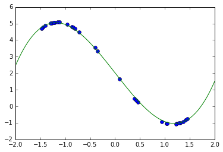

```python
# TensorFlow による曲線あてはめ
import tensorflow as tf
import numpy as np
import matplotlib.pyplot as plt
%matplotlib inline

#  y = 3 x^3 - 4x - 1.5 という関係式を使って
# 実験用に仮想の x, y のペアデータを生成し、
# TensorFlow で回帰曲線を求めてみたい。
x_data = 3*np.random.rand(30).astype(np.float32) - 1.5
y_data = x_data ** 3 - 4.0*x_data  + 2.0

# y = a x^3 + b x^2 + c x + d という曲線を当てはめるものとする
# [1] はテンソルの次元。[1]はスカラーであることを意味する。
a = tf.Variable(tf.random_uniform([1], -1.0, 1.0))
b = tf.Variable(tf.random_uniform([1], -1.0, 1.0))
c = tf.Variable(tf.random_uniform([1], -1.0, 1.0))
d = tf.Variable(tf.random_uniform([1], -1.0, 1.0))
y = a * x_data ** 3 + b * x_data ** 2 + c * x_data + d

# tf.random_uniform で指定範囲の乱数を発生させて係数 a,b,c,d の初期値を設定している。

# 目的関数の設定。平均自乗誤差の最小化
loss = tf.reduce_mean(tf.square(y - y_data))
# 最適化手法の設定。最急降下法　0.1はいわゆる学習係数　適当
optimizer = tf.train.GradientDescentOptimizer(0.1)
# loss つまり平均自乗誤差を最急降下で減少させる試みを train と名付ける
train = optimizer.minimize(loss)

# 学習を始めるためにやっておかねばならないおまじない（変数の初期化）を init とおく, 
init = tf.initialize_all_variables()

# セッションを生成し、init つまり編集の初期化を実行
sess = tf.Session()
sess.run(init)

# モデル当てはめのステップを繰り替えし実行
for step in range(201):
    sess.run(train)
    if step % 20 == 0: # 20 回毎に推定された係数値を表示
        print(step, sess.run(a), sess.run(b), sess.run(c), sess.run(d), sess.run(loss))

A = sess.run(a)
B = sess.run(b)
C = sess.run(c)
D = sess.run(d)
plt.plot(x_data,y_data,"o")

plt.hold(True);
xd = np.linspace(-2.0, 2.0, 100)
yd = A * xd ** 3 + B * xd ** 2 + C * xd + D
plt.plot(xd,yd,"-")
```

    0 [-1.13165975] [-0.13576186] [-0.48107755] [ 1.14746118] 2.55011
    20 [-0.54862851] [ 0.12699421] [-1.424721] [ 1.88724911] 0.70503
    40 [-0.13799125] [ 0.01086209] [-2.10654235] [ 2.03297615] 0.369925
    60 [ 0.16114478] [-0.03295323] [-2.60374379] [ 2.08184505] 0.199191
    80 [ 0.38034949] [-0.04462528] [-2.96834826] [ 2.08894968] 0.10855
    100 [ 0.54162937] [-0.04303323] [-3.23673511] [ 2.07987738] 0.0594752
    120 [ 0.66061425] [-0.03680862] [-3.43480253] [ 2.06609035] 0.0326649
    140 [ 0.7485559] [-0.02970916] [-3.58122563] [ 2.05239034] 0.0179592
    160 [ 0.81363261] [-0.02322139] [-3.68959427] [ 2.04051852] 0.00987865
    180 [ 0.8618288] [-0.01780772] [-3.76986027] [ 2.03087115] 0.00543495
    200 [ 0.8975423] [-0.01349627] [-3.82934141] [ 2.02330112] 0.00299043


    [<matplotlib.lines.Line2D at 0x1163b8cc0>]





```python

```
